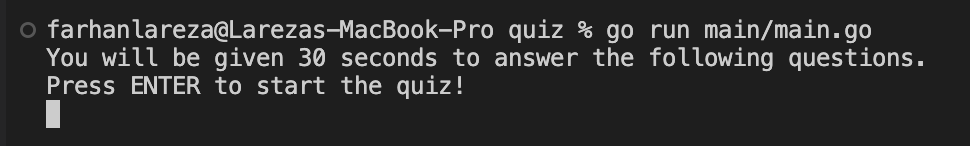
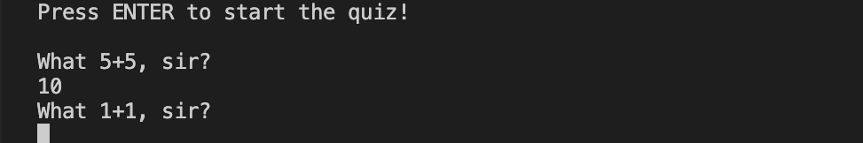

# Gophercises

## Description

This repository contains my solutions for the [gophercises](https://gophercises.com/) exercises. As a challenge, all codes are written with my own ideas without viewing the tutorial videos.

### Folder details

**1. quiz**

Solution for the [1st](https://github.com/gophercises/quiz) exercise. Activities involved: making a CLI program simulating a quiz, which reads user inputs and counts down a timer. 

To run the program:
- Open a terminal session and go to the quiz directory.  

- Execute the main.go file in the main folder to start the program. (By default, the program will take the quiz question in the problem.csv file sequentially and have a duration of 30 seconds. You can use the s flag to shuffle the quiz questions and the t flag to set the duration)  

- Answer the questions by passing numbers in the terminal.  

- Here's the final output of the program. In this example, the program exited due to the timer timeout.  

**2. urlshort**

Solution for the [2nd](https://github.com/gophercises/urlshort) exercise. Activities involved: making a simple web server that maps its paths into other URLs. The mapped paths can be specified in a JSON/YAML file or database. 

To run the program:
- Open a terminal session and go to the urlshort directory.  

- Execute the main.go file in the main folder to run the web server. (By default, the program will use the map on the pathyaml.yaml file to map its paths. You can use the f flag to specify the file or the d flag to specify a database address and use that database instead)  

- Visit the web server by using a browser. For example, we will visit the /urlshort path, and the program will redirect us to https://github.com/gophercises/urlshort as specified in the path map file.  
  

**3. cyoa**

Solution for the [3rd](https://github.com/gophercises/cyoa) exercise. Activities involved: creating a web app simulating a CYOA (Choose Your Own Adventure) experience that makes a story based on options the user chooses.

To run the program:
- Open a terminal session and go to the cyoa directory.  

- Execute the main.go file in the main directory to run the web app. (By default, the program will take the gopher.json to build the story tree. You can also use the f flag to specify the path of the file)  

- Visit the root path of the web app on a browser (it will be redirected to the /intro path). In this example, we will choose some options (the ones in a darker color) to make up our story.  
  
  
  
  
  

**4. link**

Solution for the [4th](https://github.com/gophercises/link) exercise. Activities involved: creating a program that parses an HTML file to collect links and texts from all of the "a" tags.

 To run the program:
- Open a terminal session and go to the link directory.  

- Execute the main.go file in the main folder with one argument specifying the HTML file that will be parsed. In this example, we will use the demo.html file as the target HTML file.  

**5. sitemap**

Solution for the [5th](https://github.com/gophercises/link) exercise. Activities involved: creating functions to crawl all reachable same-domain URLs from a specific URL, which runs asynchronously with the help of mutex and wait-group structs, and turn them into a sitemap XML, implementing regex match & searching.

**6. hr1**

Solution for the [6th](https://github.com/gophercises/hr1) exercise. Activities involved: creating solutions for the caesarchiper and camelcase hacker rank problems, which play with the string and rune data types.

**7. task**

Solution for the [7th](https://github.com/gophercises/task) exercise. Activities involved: creating a CLI to-do task manager program with cobra library that stores and retrieve data in a boltDB database. 

**8. phone**

Solution for the [8th](https://github.com/gophercises/phone) exercise. Activities involved: creating more robust functions to interact with a PostgreSQL database, which does queries and alters a table, and a program to normalize phone number data.

**9. deck**

Solution for the [9th](https://github.com/gophercises/deck) exercise. Activities involved: creating structs and functions to simulate items in a card game, implementing the functinal-ops coding pattern in a function, and using stringer with go-generate to work with enum-like objects.

**10. blackjacks**

Solution for the [10th](https://github.com/gophercises/blackjack) and [11th](https://github.com/gophercises/blackjack_ai) exercises. Activities involved: creating a CLI program simulating a blackjack game and making use of the interface data structure to generalize the AI behavior algorithms. 

**11. renamer**

Solution for the [12th](https://github.com/gophercises/renamer) exercise. Activities involved: Creating functions that will traverse a directory recursively and rename files in that directory (and its subdirectory) that match a pattern specified to follow a given naming pattern. 

**12. quiet_hn**

Solution for the [13th](https://github.com/gophercises/quiet_hn) exercise. Activities involved: Creating functions that concurrently retrieve data from an API and order back the returned data to follow the original ordering positions, using a wait-group and channel.

**13. recover**

Solution for the [14th](https://github.com/gophercises/recover) and [15th](https://github.com/gophercises/recover_chroma) exercises. Activities involved: Creating functions that simulate a panic-recovery event in a web server and show its stack tracks and making use of the Chroma syntax-highlighting library to show a syntax-highlighted source code on the browser. 

**14. secret**

Solution for the [17th](https://github.com/gophercises/secret) exercise. Activities involved: Making a CLI program to store and retrieve data from a file that is encrypted, which uses the stream reader and writer from the go's cipher library.

**15. transform**

Solution for the [18th](https://github.com/gophercises/transform) exercise. Activities involved: Making a web app generating images from an image uploaded by the user, specifically, the APIs that process the uploaded image, which makes use of the exec library, and the front end that fetches the APIs. 

**16. img**

Solution for the [19th](https://github.com/gophercises/image) exercise. Activities involved: Making functions to draw chart bars on a png and SVG file, using the built-in image library and the svggo library. 

**17. pdf**

Solution for the [20th](https://github.com/gophercises/pdf) exercise. Activities involved: making functions to create an invoice and certificate pdf, using the gofpdf library. 