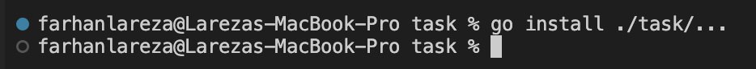
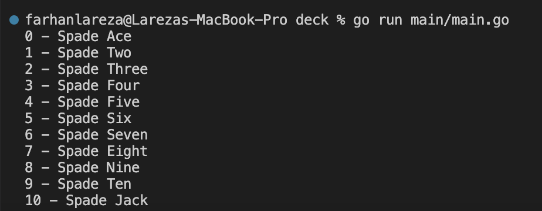
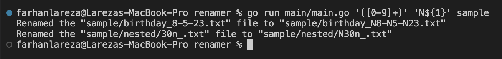
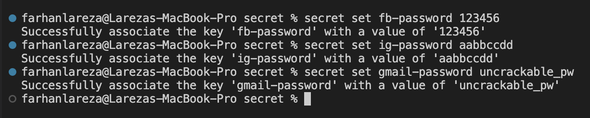
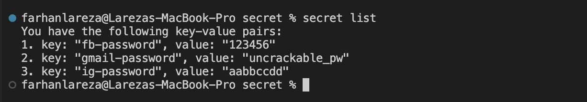

# Gophercises

## Description
This repository contains my exploration for the [gophercises](https://gophercises.com/) exercises. As a challenge, all source codes written are my ideas without viewing the tutorial videos. (Note: Please visit each link corresponding to a specific exercise to see the official exercise detail)

### Folder details

**1. quiz**

This is the solution for the [1st](https://github.com/gophercises/quiz) exercise. Activities involved: making a CLI program simulating a quiz, which reads user inputs and counts down time. 

To run the program:

- Open a terminal session and go to the quiz directory.  

- Run the main.go file in the main folder to start the program. (By default, the program takes the quiz questions in the problem.csv file sequentially and has a duration of 30 seconds. You can use the s flag to shuffle the quiz questions and the t flag to set the duration)  

- Answer the questions by passing numbers on the terminal.  

- Here's the final output of the program. (In this example, the program exited due to the timeout)  

**2. urlshort**

This is the solution for the [2nd](https://github.com/gophercises/urlshort) exercise. Activities involved: making a simple web application that maps its paths to other paths. The mapped paths can be specified in a JSON/YAML file or database. 

To run the program:

- Open a terminal session and go to the urlshort directory.  

- Run the main.go file in the main folder. (By default, the program uses the path map from the pathyaml.yaml file. You can use the f flag to define a path of another file or use the d flag to specify a database address and use that database instead)  

- Visit the web server by using a browser. (The example below visited the /urlshort path, and the program redirected the request to https://github.com/gophercises/urlshort, which is the same as what was specified in the path map)  
  

**3. cyoa**

This is the solution for the [3rd](https://github.com/gophercises/cyoa) exercise. Activities involved: creating a web app simulating a CYOA (Choose Your Own Adventure) experience that makes a story based on options the user chooses.

To run the program:

- Open a terminal session and go to the cyoa directory.  

- Run the .go files in the main directory to start the web application. (By default, the program takes the gopher.json file to build the story tree. You can use the f flag to specify a path of another file)  

- Visit the root path of the web app on a browser (it will be redirected to the /intro path). (In this example, we chose some of the available options (the ones in a darker color) to make our story)  
  
  
  
  
  

**4. link**

This is the solution for the [4th](https://github.com/gophercises/link) exercise. Activities involved: creating a program that parses an HTML file to collect links and texts from the "a" tags.

 To run the program:

- Open a terminal session and go to the link directory.  

- Run the main.go file in the main folder with exactly one argument specifying the HTML file that will be parsed. (The example below used the demo.html file as the target HTML file)  

**5. sitemap**

This is the solution for the [5th](https://github.com/gophercises/link) exercise. Activities involved: creating a program that crawls all reachable same-domain URLs from a given URL and maps the returned URLs into a sitemap XML.

To run the program:

- Open a terminal session and go to the sitemap directory.  

- Run the main.go file in the main folder with exactly two arguments, one for the target URL that will be crawled and the other one for the path of the output file. (By default, this program crawls the target URL for a maximum depth of 2. You can customize this value by using the d flag)   

- In the above example, we crawled one of the main pages of Wikipedia and stored the resulting sitemap at demo.xml. Here's what the result looks like.  

**6. hr1**

This is the solution for the [6th](https://github.com/gophercises/hr1) exercise. Activities involved: creating solutions for Hackerrank's caesarchiper and camelcase problems and a program making use of those algorithms.

To run the program:

- Open a terminal session and go to the hr1 directory.  

- Execute the main.go file in the main folder with exactly two arguments. The first argument specifies the text that will be encrypted with the Caesar-chipper encryption, and the second one defines the offset value for the encryption. (The following example ran the program with "testTheProgram" as the target text and the number one as the offset)  

- And here's the Hackerrank result of the solutions.  
  

**7. task**

This is the solution for the [7th](https://github.com/gophercises/task) exercise. Activities involved: creating a CLI program that can be used to manage a list of to-do tasks and store the data in a local boldDB database.

To run the program:

- Open a terminal session and go to the task directory.  

- Before we install the CLI program, make sure we have the correct GOBIN environment variable pointing to our go bin folder. Below is the sample correct output of echoing the GOBIN variable.  

- Install the entry of the CLI program that is beneath the inner task folder.  

- Check if the program is installed correctly by running the task command with no additional subcommands or arguments. (The output of this command will also show the documentation of the command, including the available subcommands)  

- Run the task command followed by one of its subcommands and arguments for that subcommand. (Let's say we're going to add "cleaning rooms", "studying math", and "fixing the car" to our to-do list. We can do these as follow)  

- Use the list subcommand to show the list of currently active to-do tasks.  

- You can mark an active task as done by using the do subcommand and list all marked tasks with the completed subcommand. (In the below example, we deleted the "studying math" task and then checked the the list of completed and active tasks)  

**8. phone**

This is the Solution for the [8th](https://github.com/gophercises/phone) exercise. Activities involved: creating a program that stores normalized (same format) and no duplicate phone numbers in a PostgreSQL database.

To run the program:

- Open a terminal session and go to the phone directory.  

- Before we run the program, make sure we have the database running. (Here, we will use a local database named Custom and store the data in the phone_numbers table, which is currently empty)   

- Now, run the main.go file in the main folder followed by any number of arguments specifying the phone numbers that will be stored. (By default, to initiate the database connection, the program uses the default database configuration (which specifies the address of the database, username, etc.). You can use the d flag to customize this configuration)  

- In the above example, we stored three phone numbers, and the program printed the inputted and resulting phone numbers. Let's check again our previously empty database table. It should now have been populated with the new data.  

**9. deck**

This is the solution for the [9th](https://github.com/gophercises/deck) exercise. Activities involved: creating a package representing a card in a card game, specifically a suit card game. There's no real program in this directory, but there is one printing the contents of a newly created deck.

To run the program:

- Open a terminal session and go to the deck directory.  

- Run the main.go file in the main directory. (By default, the program creates a deck of suit cards with no joker included and sorts the deck based on the ascending order of the card IDs. Use the j flag to specify the number of jokers and the s flag to point out the index of the built-in sorting algorithms that will be used)  

**10. blackjacks**

This is the solution for the [10th](https://github.com/gophercises/blackjack) and [11th](https://github.com/gophercises/blackjack_ai) exercises. Activities involved: creating a CLI program simulating the blackjack card game.

To run the program:

- Open a terminal session and go to the blackjack directory.  

- Run the main.go file in the main folder with any number of arguments specifying the active players that will be added to the game. (By default, other than the players, the program initiates the game with one dealer and one AI. You can customize the number of AIs by using the c flag. In the following example, we created the game with two computers and one player named Farhan)  

- Let's interact more with the program by playing one round of the game.  

**11. renamer**

This is the solution for the [12th](https://github.com/gophercises/renamer) exercise. Activities involved: Creating a program that renames files matching a definite pattern in a specific directory.

To run the program:

- Open a terminal session and go to the renamer directory.  

- Before we run the program, let's take a look at the folder that we will use as the target directory.  

- Run the main.go file in the main folder with exactly three arguments. The first argument specifies the pattern used to find the target files and parts of the names of the files that will be altered, the second one defines the replacement words for altering the file names, and the third one points out the path of the folder that will be scanned by the program. After running the command, check again the previous folder to see the result  
  

- Additionally, you can also use regex patterns for the first and second arguments. (In the following example, we used regex patterns to match sequences of digits and append the N letter at the front of the sequences)  

**12. quiet_hn**

This is the solution for the [13th](https://github.com/gophercises/quiet_hn) exercise. Activities involved: Creating a web application that retrieves stories from one of the Hackernews' APIs and shows the top stories based on the query parameter of the path.

To run the program:

- Open a terminal session and go to the quiet_hn directory.  

- Run the main.go file in the main folder to start running the web application. (By default, the application creates variables in memory for caching that will be refreshed every ten seconds. You can use the r flag to change the time for caching refreshment)  

- Let's visit our running web application on a browser. (The application returns the top 30 stories from the API if the user visits its root path with no additional parameter. You can set the n query parameter to specify the number of stories returned)  
  

**13. recover**

This is the solution for the [14th](https://github.com/gophercises/recover) and [15th](https://github.com/gophercises/recover_chroma) exercises. Activities involved: Creating a web application simulating a panic-recovery event and printing the stack traces and source codes related to that event on the browser.

To run the program:

- Open a terminal session and go to the recovery directory.  

- Run the main.go file in the main folder to start the web server. (The stack trace and source code printing features are only available for the dev mode, but this is the mode chosen by default. You can change this using the d flag)  

- Let's visit the root path of our web.  

- Though there are not many things there, the web application is running normally. Now, let's visit the /panic path of the web application.   

- The above output indicates the web application has recovered from a panic situation, and the stack traces printed are the traces for the corresponding panic situation. Click one of the links provided to show the source code associated with the given stack trace. (Below, we clicked the link at the very top of the stack traces and are shown the source code corresponding to that stack trace)  

**14. secret**

This is the solution for the [17th](https://github.com/gophercises/secret) exercise. Activities involved: Making a CLI program that stores and retrieves key-value pair data from encrypted storage living in a file.

To run the program:

- Open a terminal session and go to the secret directory.  

- Install the entry of the program beneath the inner secret folder. (Make sure you have the GOBIN environment variable set correctly)  

- Run the secret command with no additional subcommands or arguments to test if the program is installed correctly. You should also see the documentation of the program as follow.  

- Let's populate some data into our storage by using the set subcommand. (By default, all of the commands executed use the default encoding key and storage file path. Use the k flag to change the encoding key and the f flag to point out a path of another file that will be used. In the example below, we stored three "key:value" pair data into our encrypted storage, namely "fb-password:123456", "ig-password:aabbccdd", and "gmail-password:uncrackable_pw")  

- Use the list subcommand to show key-value pairs stored in our storage and the get subcommand to get an individual value of a specific key.   

- Below was the content of the file used for the encrypted storage after adding some data. As you can see, it is encrypted and unreadable.  

**15. transform**

This is the solution for the [18th](https://github.com/gophercises/transform) exercise. Activities involved: Making a web application that generates primitive-shape brushed images from an image uploaded by the user.

To run the program:

- Open a terminal session and go to the transform directory.  

- Run the .go files beneath the main folder to start serving the web application.  

- Let's take a look at the root path of our application on a browser.  

- Select an image in your local workspace to specify the base of our upcoming generated images. Then, click the submit button to upload the image to the backend.  
  

- After several seconds, the backend will return with eight generated images in different modes. Select one of the modes you like and then click the submit button. (In the example below, we chose the triangle mode to proceed with this step)  
  

- The final results of the generated images are returned after a moment. In this scenario, the generator used different numbers to draw the shape we chose earlier. You can download the results of the images by clicking the download buttons.  

**16. img**

This is the solution for the [19th](https://github.com/gophercises/image) exercise. Activities involved: Making a program that draws a chart on a PNG or SVG file.

To run the program:

- Open a terminal session and go to the img directory.  

- Run the main.go file in the main folder with exactly two arguments. The first argument specifies the path of the CSV file containing the chart data and the second one defines the path for the output file. (In this example, we drew the chart on two of the possible output formats, which are PNG and SVG. We used the data from the demoData.csv file and defines the demoPNG.png and demoSVG.svg as the output paths)  

- Now, let's take a look at our created files on a browser. (As you might have noticed, the SVG version is made more sophisticated than the PNG one. This is due to the robustness of the svggo library supporting the limited time, whereas the PNG version uses the basic built-in image library with finite functionality)
  

**17. pdf**

This is the solution for the [20th](https://github.com/gophercises/pdf) exercise. Activities involved: creating two programs related to pdf, one that makes an invoice letter on a PDF file and the other one creates a certificate instead. We will cover both of the programs in the demonstration below.

To run the program:

- Open a terminal session and go to the pdf directory.  

- Let's run the first program by running the main.go file in the invoice folder with exactly two arguments. The first argument is for the path of the input data file and the other one is for the path of the output file. (The following example used the data from the demoInvoice.csv file and put the result at demoInvoice.pdf)  

- Let's take a look at the resulting PDF of the first program on a browser. (As a note, though the resulting PDF contained a lot of data (like a phone number, client name, etc.), for now, we are only able to alter the data that are in the item detail section)  

- Now, we can start running our second program to create a certificate. Run the main.go file in the cert directory with exactly two arguments. The first argument is for the name of the certificate holder, and the second one is for the output path. (Below, we defined the full name of this repository author, Lareza Farhan Wanaghi, as the certificate holder's name and specified demoCert.pdf as the output path)  

- Let's check our created certificate on a browser.  

### Conclusion
To conclude, in this journey of exploring the [gophercises](https://gophercises.com/) exercises, the exercises have made me explore many things in the GO world, including handling inputs, parsing data, building APIs, web applications, and CLI programs, making use of databases, dealing with encryption, and manipulating PDFs and images. As a compliment, in my opinion, the exercises were quite fun to do and taught the takers many things related to GO.

### Disclaimer
The [16th](https://github.com/gophercises/twitter) exercise is, unfortunately, skipped since the Twitter API used is no longer free to use.